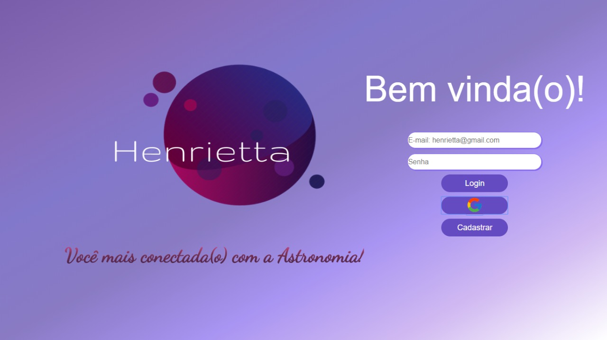
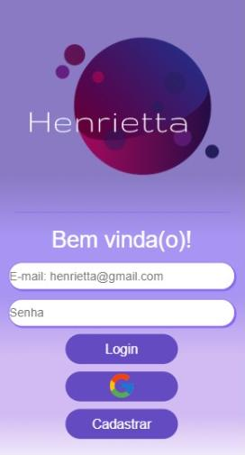

# Henrietta

## Índice

* [1. Sobre o projeto](#1-sobre-o-projeto)
* [2. Histórias de usuários](#2-historias-de-usuarios)
* [3. Funcionalidades da aplicação](#3-funcionalidades-da-aplicação)
* [4. Protótipos](#4-prototipos)
* [5. Ferramentas utilizadas](#5-ferramentas-utilizadas)

***

## 1. Sobre o projeto
***

Esta é uma rede social desenvolvida para aproximar amantes da astronomia, possibilitando assim trocas de informações. A partir das histórias de usuários fornecidas desenvolvemos funcionalidades de acordo com as necessidades.

O nome da rede social foi escolhido como forma de homenagear Henrietta Swan Leavitt,uma astrônoma que iniciou a sua carreira medindo e catalogando o brilho de estrelas da coleção de chapas fotográficas no Harvard College Observatory.Na época (1893), não era permitido a mulheres operar telescópios e mesmo assim se firmou na área, trazendo grande descobertas como a relação período-luminosidade. 

Para mais informações sobre a vida e carreira de Henrietta acesse: 

https://pt.wikipedia.org/wiki/Henrietta_Swan_Leavitt

http://lilith.fisica.ufmg.br/~dsoares/reino/hleavitt.htm

***
## 2. Histórias de usuários
***

_1_: Como usuário novo, devo poder ter a opção de iniciar sessão com minha conta do Google e ingressar na Rede Social sem necessidade de criar uma conta de email válido.

_2_: Como usuário novo, devo poder criar uma conta com email e senha válidos para poder iniciar uma sessão e ingressar na Rede Social.

_3_: Como usuário logado devo poder criar, guardar no mesmo lugar (in place) e deletar publicações (post) privadas ou públicas.

_4_: Eu como usuário logado, posso dar like e ver a contagem de likes em minhas publicações

***
## 3. Funcionalidades da aplicação
***

Com base nas histórias de usuários, foram desenvolvidas as seguintes funcionalidades:

* Realizar login com uma conta Google
* Realizar cadastro com email e senha
* Efetuar login com email e senha
* Criar publicações
* Armazenar publicações
* Mostrar publicações
* Deletar publicações
* Dar like e aumentar a contagem de likes

As funcionalidades tiveram as usabilidades testadas manualmente, sendo possível corrigir os erros apresentados durante o desenvolvimento.

***
## 4. Protótipos
***

Após estabelecer as funcionalidades e receber o protótipo do layout da aplicações, fizemos o esboço das rotas e a paleta de cores que seria utilizada. A aplicação foi desenvolvida com base no conceito de [_mobile first_](ttps://tableless.com.br/obile-first-a-arte-de-pensar-cm-foco/), sendo a responsividade pensada desde o início do projeto.

_Foto do layout web_

_Foto do layout mobile_

***
## 5. Ferramenstas utilizadas
***

Para desenvolver a aplicação, utilizamos as seguintes ferramentas:

* Vanilla JavaScript
* HTML
* CSS
* Firebase
* Firestore
* GIT
* GitHub
* Visual Studio Code
* Trello

***