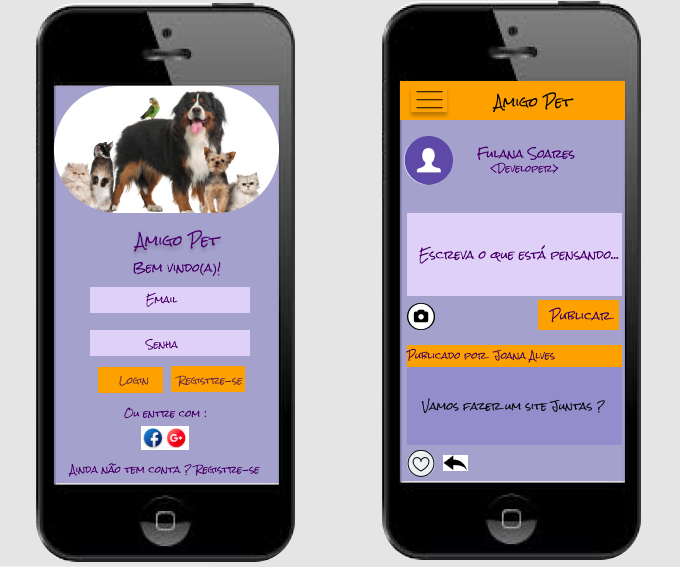
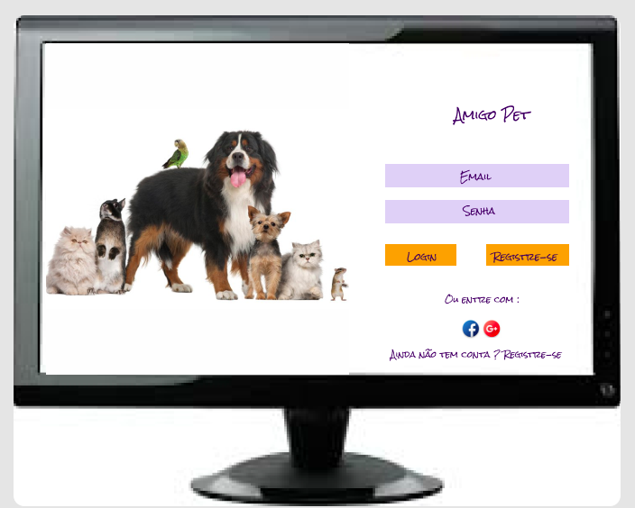

# Rede Social - Amigo Pet

Amigo Pet é uma rede social que tem por obejtivo atender as pessoas que querem realizar trocas de experiências ou doações de objetos e animais de estimação. Esta ferramenta proporcionará um aumento no número de contatos dos usuários, gerando mais facilidade para encontrar pessoas dispostas a realizar trocas ou interessadas em adotar. Os usuários terão este canal único para encontrar o que precisa, seja um novo amigo pet ou objetos tais como: Remédios, casinhas, coleiras, brinquedos e etc.

## Resumo do Projeto

- Nesta aplicação temos uma página de logar com e-mail e senha;
- O login também pode ser feito pelo Gmail;
- Uma tela de cadastro para novos usuários;
- Uma Timeline pública para que todos possam ter conhecimento dos eventos de trocas e doações;
- Na Timeline o post é identificado com e-mail do usuário, (para que os interessados possam entrar em contato posterior) e data;
- É possível deletar o post caso a troca ou doação tenha sido realizada;
- Foi utilizado HTML5, Vanilla JS, CCS3 e Firebase;
- Este projeto foi desenvolvido como uma Single-Page com enfoque em mobile first. É responsivo.

##  Protótipos

* Tela mobile

    

* Tela Desktop

    

## Paleta de Cores

## Histórias de Usuário

* Como usuário novo, devo poder criar uma conta com email e senha válidos para poder iniciar uma sessão e ingressar na Rede Social, se o email ou senha não forem válidos, ao momento de logar, irá aparecer uma mensagem de erro e redirecionar a tela de cadastro.

* Como usuário novo, devo poder ter a opção de iniciar sessão com minha conta do Google para ingressar na Rede Social sem necessidade de criar uma conta de email válido.

* Como usuário logado devo poder criar, guardar e deletar publicações.

* Como usuário logado devo poder ver todos os posts públicos que criei até o momento, do mais recente para o mais antigo.

* Eu como usuário logado, posso escrever, salvar e deletar um comentário em minhas publicações.